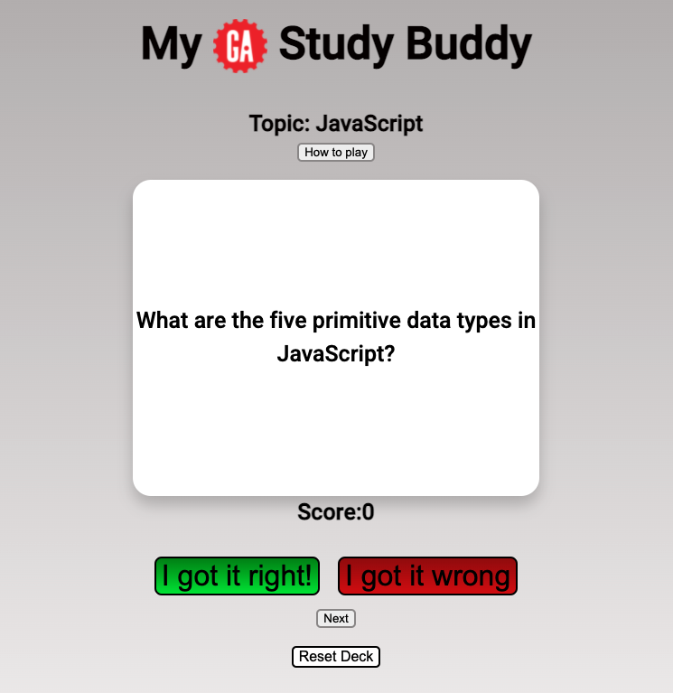
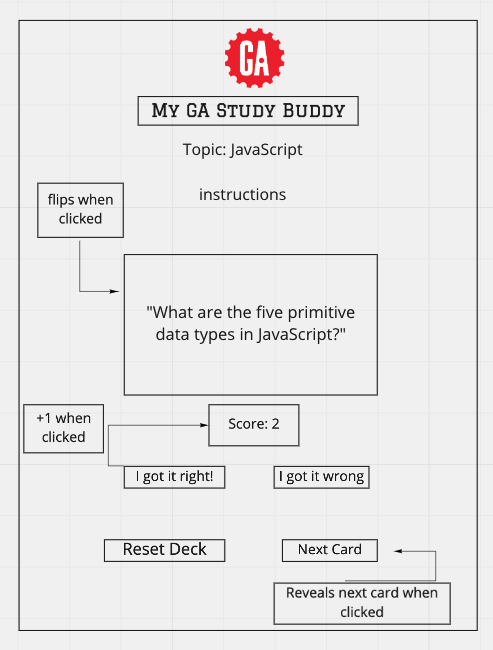

# My-GA-Study-Buddy
My GA Study Buddy is a deck of flash cards built with HTML, CSS and JavaScript. 
https://tsucodes.github.io/

## Resources 
Used to flip card
https://css-tricks.com/almanac/properties/b/backface-visibility/
https://css-tricks.com/almanac/properties/t/transform/
https://css-tricks.com/almanac/properties/t/transition/

## User stories
 As a programmer Google will always be your best resource however, as a beginner have you ever found yourself stuck wondering what to google? My GA Study Buddy is for General Assembly students that want to improve their familiarity with key Javascript terms. By reviewing JavaScript flashcards students will be able to reinforce what they learn in class and hopefully become better Googlers.

As a user I want to see the topic of what I am studying displayed on the page, so I know what i am studying.

As a user I want to see a box displayed on the page that contains a question

As a user I want to click the question box and it flips to reveal the answer is on the other side

As a user I want to be able to keep track of my correct or incorrect answers

As a user I want to click a button that says "I got it right" and it adds to my score

As a user I want to click a button that says "I got it wrong" and it does not add to my score.

As a user I want to be able to click the next button and it reveals the next question card

As a user I want to click the button "reset deck" and the cards go back to question 1.

## Wireframe

## Unsolved problems
 My reset button places the deck of cards back to the beginning however it does not restart the game. In its’ current state the user must refresh the page in order to review the cards again.

The code also just cycles through an array of questions. I shoulve have had the cards move to separate stacks after the self-scoring buttons were clicked so the user can review which questions they got right or wrong.